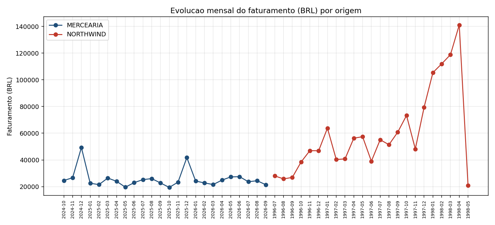
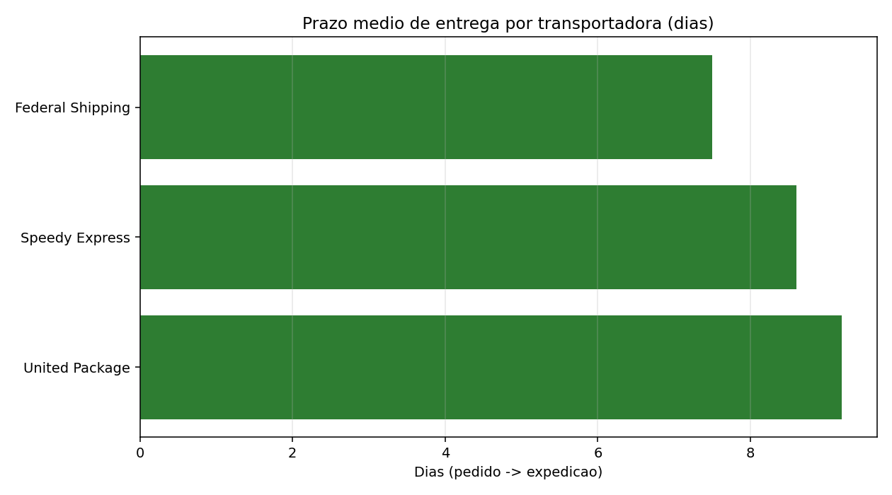
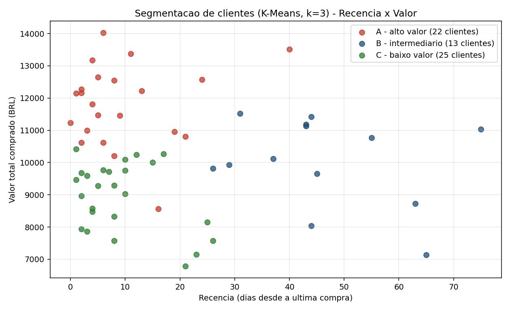
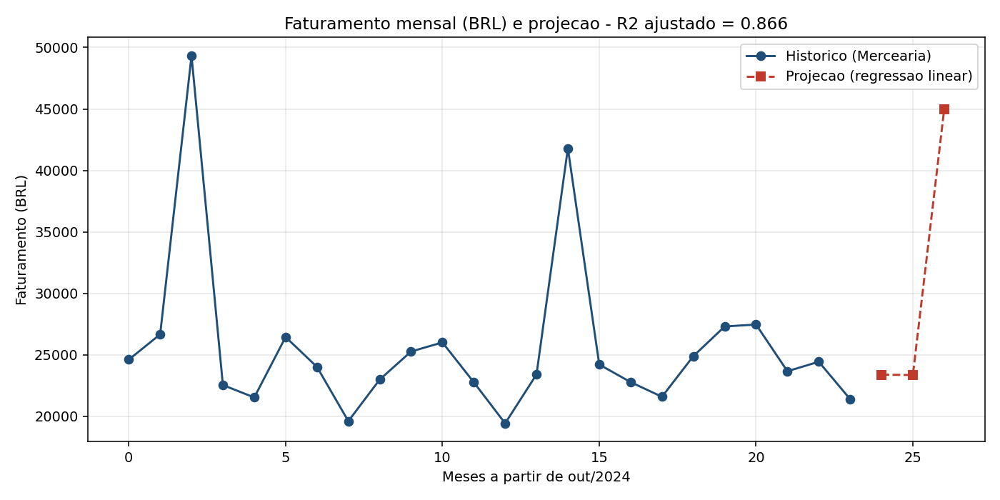

# RELATÓRIO TÉCNICO — Data Warehouse Organizacional e DataMarts

| Campo | Valor |
|---|---|
| **Instituição** | Instituto Federal de Goiás (IFG) — Campus Goiânia |
| **Disciplina** | Tópicos Avançados em Inteligência Artificial I |
| **Professor** | Sirlon Diniz |
| **Autor** | Daniel Flávio |
| **Data de entrega** | 30/09/2026 |

---

## 1. Objetivo

Construir um **Data Warehouse (DW) Organizacional** que integra duas bases diferentes — **Northwind** e
**Mercearia** — e, a partir dele, criar **três DataMarts** de assuntos distintos, aplicando ferramentas
de análise de dados sobre o DW e sobre os DataMarts.

O trabalho atende aos conceitos pedidos: **granularidade**, **integração**, **historicidade**,
**dimensão tempo**, **dados externos** e **LGPD**.

---

## 2. Fontes de dados

| Fonte | O que contém |
|---|---|
| **Northwind** | Dump PostgreSQL **com dados**: 830 pedidos, 2.155 itens, 91 clientes, 77 produtos, 29 fornecedores, 9 funcionários, 6 transportadoras e entregas em **21 países** |
| **Mercearia** | **Somente DDL**, sem nenhum registro: 14 tabelas, com endereços brasileiros em 5 níveis (UF → Cidade → Bairro → Logradouro → Endereço) |

### Declaração sobre a Mercearia

O material de origem da Mercearia **não acompanha dados**. Para que a integração das duas fontes fosse
demonstrável, foi criada uma massa **sintética e declarada** (`sql/seed_mercearia.sql`): nomes e empresas
fictícios, **CPF/CNPJ inválidos por construção** (só para exercitar o mascaramento) e 3.171 vendas ao
longo de 24 meses. **Nenhum dado real de pessoa foi usado**, e o arquivo original permanece intacto.

---

## 3. Arquitetura da solução

```
  Northwind ---\
                >--- public (staging) ---> dw (DW: 7 dimensões + 3 fatos)
  Mercearia ---/                              |
  IBGE -------\                               +---> dm_vendas       (assunto: comercial)
  BCB/PTAX ---/--> ext (dados externos)       +---> dm_suprimentos  (assunto: compras)
                                              +---> dm_logistica    (assunto: entregas)
```

- **SGBD:** PostgreSQL 16 em Docker. Tudo sobe e carrega com **um comando**:
  `docker compose exec -T db sh /etl/00_carga_inicial.sh`
- **ETL:** em **SQL puro** (o enunciado permite ferramenta; optou-se por SQL por ser auditável e
  reproduzível sem instalar nada além do banco).

---

## 4. Decisões de modelagem

### 4.1 Granularidade: o que cada linha representa

| Fato | Grão | Por quê |
|---|---|---|
| `fato_vendas` | 1 linha por **item** de pedido | menor detalhe disponível; permite somar depois |
| `fato_compras` | 1 linha por **item** de compra | mesma razão, para o processo de compras |
| `fato_entregas` | 1 linha por **pedido** | o frete é medido no pedido, não no item |

**Por que o terceiro fato tem outro grão?** No Northwind, o frete (`orders.freight`) é um valor **do
pedido**. Se fosse colocado no fato de item, o mesmo frete apareceria **repetido em cada item** do
pedido (dupla contagem) ou teria que ser rateado — um número que não existe na origem. A solução
correta é **um fato por grão**, com **dimensões conformadas** compartilhadas. Ou seja: a granularidade
não é detalhe técnico, ela **muda o resultado do número**.

### 4.2 Integração das duas fontes

| Mecanismo | Aplicação |
|---|---|
| **Chave natural por origem** | coluna `origem` (`MERCEARIA` / `NORTHWIND`) + chave da fonte |
| **Dimensões conformadas** | produto, cliente, fornecedor, localidade e tempo servem aos três fatos |
| **Padronização de país** | `Brazil` (Northwind) e `Brasil` (Mercearia) viram **o mesmo país** |
| **Normalização de texto** | `Sao Paulo` e `São Paulo` reconhecidos como a **mesma cidade** |
| **Chave oficial externa** | `codigo_ibge` no município, para casar com sistemas oficiais |

### 4.3 Historicidade — SCD Tipo 2

Aplicado em **`dim_produto`** (preço) e **`dim_cliente`** (faixa de renda). A dimensão guarda
`versao`, `data_inicio`, `data_fim` e `flag_atual`.

**Não basta declarar no DDL — foi testado.** O teste (`etl/90_teste_scd2.sql`) altera o preço do arroz
na origem e recarrega a dimensão:

| Versão | Preço | Vigente | Data fim | Vendas ligadas |
|---|---|---|---|---|
| 1 | 24,90 | não | 28/09/2026 | **324 linhas (R$ 50.845,80)** |
| 2 | 27,39 | **sim** | — | — |

As **vendas antigas continuaram presas à versão antiga**, com o preço da época. Sem SCD2, o passado
seria reescrito e a receita histórica ficaria distorcida.

### 4.4 Dimensão tempo

`dim_tempo` no grão de **dia**, de **01/01/1996 a 31/12/2026** = **11.323 dias**, com **281 feriados** e
**62 pontos facultativos**. O período é a **união** dos períodos das duas fontes: se fosse gerado só o
período recente, as 2.155 vendas do Northwind ficariam **órfãs**. A dimensão é usada em **papel duplo**
(ex.: data da venda e data do faturamento).

**Rigor conceitual:** Carnaval e Corpus Christi foram marcados como **ponto facultativo**, e não como
feriado, porque **não são feriados legais**. O 20/11 (Consciência Negra) só é feriado **a partir de
2024**, conforme a Lei 14.759/2023. Essa distinção gerou um achado de negócio (item 7).

### 4.5 Dados externos e conversão de moeda

| Dado externo | Fonte | Onde entra |
|---|---|---|
| Código do município e população | **IBGE** | `dim_localidade` |
| Cotação USD→BRL do dia | **BCB / PTAX** | `fato_vendas.taxa_cambio` |
| Feriados (calculados pela Páscoa) | calendário | `dim_tempo` |

Foram extraídos **39 municípios** e **750 cotações** PTAX (1996–1998), com fonte e data de acesso
registradas em `dados_externos/README.md`.

**Por que converter?** O Northwind está em **dólar** e a Mercearia em **real**. Somar as duas moedas
produziria um número sem sentido. A regra adotada: converter pela **PTAX de compra do dia da venda** e
**gravar a taxa na própria linha** do fato, para permitir auditoria. Taxas aplicadas: de **1,0040** a
**1,1445** BRL por USD.

---

## 5. DataMarts

Cada DataMart é um **esquema estrela próprio**, materializado como tabelas físicas e carregado a partir
do DW. As dimensões mantêm a **mesma chave** do DW, e isso é verificado por teste.

| # | DataMart | Assunto | Fato (grão) | Dimensões | Linhas |
|---|---|---|---|---|---|
| 1 | `dm_vendas` | desempenho comercial | `fato_vendas` (item) | tempo (papel duplo), produto, cliente, localidade, vendedor | 11.651 |
| 2 | `dm_suprimentos` | compras e abastecimento | `fato_compras` (item) | tempo (papel duplo), produto, fornecedor | 302 |
| 3 | `dm_logistica` | entregas e frete | `fato_entregas` (pedido) | tempo (papel duplo), cliente, localidade, transportadora | 830 |

**1 — Vendas.** Apoia decisões de preço, mix de produtos, desconto e alocação de vendedor. Dimensões:
tempo (papel duplo), produto, cliente, localidade e vendedor.

**2 — Suprimentos.** Apoia a decisão de compra: de quem comprar, a que custo e com que prazo. O
Northwind não tem compras, então este DataMart é da Mercearia — **mas compartilha a mesma
`dim_produto`** do DataMart de Vendas, o que permite cruzar **custo de compra × preço de venda**.

**3 — Logística.** Existe pela razão técnica do item 4.1: o frete é do pedido. Apoia a escolha de
transportadora (prazo e frete) e mostra o efeito de feriados no prazo.

**Recorte:** cada DataMart carrega apenas as dimensões e os membros que os seus fatos usam. No DataMart
de Logística, CPF, faixa de renda e data de nascimento foram **omitidos** (minimização de dados). Todas
as versões históricas usadas pelos fatos são mantidas, senão as vendas antigas ficariam órfãs.

---

## 6. Processo de ETL e testes

| Etapa | O que faz |
|---|---|
| **Extract** | carrega Northwind e Mercearia no schema `public` e cria a massa sintética declarada |
| **Dados externos** | carga do IBGE, da PTAX, do calendário de câmbio e dos feriados |
| **Transform + Load** | dimensão tempo, as 7 dimensões (com mascaramento LGPD) e os 3 fatos (com conversão de moeda) |
| **DataMarts** | cria e carrega os 3 DataMarts e roda os testes de integridade |

**Transformações principais:** conversão USD→BRL com a taxa gravada; padronização de país e de nome de
cidade; mascaramento de CPF/CNPJ; generalização de renda em faixas; telefones **não** carregados;
tratamento de nulos (21 pedidos sem expedição, por exemplo) sem inventar valor.

**Resultados dos testes:**

| Teste | Resultado |
|---|---|
| Contagens origem × DW (13 comparações) | **todas iguais** |
| Identidade contábil das medidas (11.651 linhas) | **0 erros** |
| Registros órfãos | **0** |
| Versão vigente única por chave (SCD2) | **100%** |
| **Conformidade entre DataMarts** (mesmo membro = mesmos valores) | **0 divergências** |
| LGPD: colunas sensíveis no DataMart de Logística | **0** |

**Defeitos encontrados e corrigidos no processo:** 7 no total. Dois deles merecem registro, porque
**passaram por todos os testes de contagem** e só apareceram quando o dado foi **usado** na análise: a
mesma cidade entrando duas vezes (`Sao Paulo` e `São Paulo`) e a UF `SP` aparecendo com dois rótulos
diferentes. A lição: **teste de contagem não substitui teste de uso**.

---

## 7. Análise de dados

**Ferramenta:** Python 3.13 (pandas, matplotlib, scikit-learn), conectado direto ao banco e aplicado
**ao DW e aos DataMarts**. Script: `analise/analise_dw_datamarts.py`.

Faturamento total: **R$ 1.991.124,46** · prazo médio de entrega: **8,5 dias** · frete médio: **R$ 85,20**.



*Figura 1 — Evolução mensal do faturamento (BRL) por origem (Northwind 1996–1998 e Mercearia 2024–2026).*

**Resultados principais:**

1. **Sazonalidade:** fim de semana vende **~1,5× mais** que dia útil. E **feriado legal vende 21%
   MENOS** que um dia comum (R$ 670,76 contra R$ 846,29), enquanto Carnaval e Corpus Christi (ponto
   facultativo) vendem **mais** (R$ 947,02) — o que **justifica** a flag separada na dimensão tempo.
2. **Dezembro** é pico nas duas bases, mesmo sendo fontes de épocas diferentes.
3. **Mercearia fatura por volume; Northwind por valor unitário** — o topo do ranking é dominado por
   produtos caros do Northwind, enquanto a fralda lidera na Mercearia.
4. **Logística:** a United Package concentra o maior volume (326 pedidos), tem o **pior prazo**
   (9,2 dias) e o **maior frete** (R$ 94,80) — prioridade de renegociação.

   

   *Figura 2 — Prazo médio de entrega por transportadora (dias).*

5. **IA — segmentação de clientes (K-Means sobre RFM):** 60 clientes em 3 grupos. O grupo intermediário
   (13 clientes) tem valor próximo ao topo, mas **46 dias sem comprar** — melhor oportunidade de
   reativação.

   

   *Figura 3 — Segmentação de clientes (K-Means, k=3) sobre recência × valor.*

6. **IA — projeção de vendas (regressão linear):** R² = **0,866**, com **efeito de dezembro de
   +R$ 21.686,08** (projeção do próximo dezembro: R$ 44.994,89). O bom ajuste vem da **sazonalidade**,
   não de crescimento.

   

   *Figura 4 — Faturamento mensal e projeção por regressão linear.*

**Limitações declaradas:** a margem por produto saiu uniforme em 35% por ser **artefato dos dados
sintéticos** (o custo foi gerado como 65% do preço) — o método está correto, o número não é
interpretável. E o seed sintético faz os clientes comprarem com frequência parecida, então a
segmentação separou sobretudo por valor. Com dados reais, ambos os resultados seriam mais ricos.

---

## 8. LGPD

Aplicada de forma preventiva, embora os dados usados sejam públicos ou sintéticos:

| Medida | Onde |
|---|---|
| **Minimização** — telefones **não** entram no DW | tabela `Telefones` |
| **Mascaramento** — CPF/CNPJ vira `***.***.***-XX` | `dim_cliente.cpf_cnpj_masked` |
| **Generalização** — renda exata vira **faixa** | `dim_cliente.faixa_renda` |
| **Minimização por assunto** — sem CPF, renda e nascimento no DataMart de entregas | `dm_logistica.dim_cliente` |
| **Dados sintéticos declarados** — nenhum dado real de pessoa | `sql/seed_mercearia.sql` |

---

## 9. Conclusão

O trabalho entregou um DW que **integra de fato** duas fontes de estruturas e semânticas diferentes:
quatro dimensões recebem registros das duas bases, os rótulos conflitantes foram padronizados e as
medidas ficaram homogêneas com conversão cambial auditável.

Os três itens da atividade foram atendidos: (1) o DW integrando Northwind e Mercearia; (2) **três
DataMarts** modelados com assunto, grão, dimensões e justificativa, com DDL própria; (3) **análise de
dados aplicada ao DW e aos DataMarts**, incluindo dois modelos de aprendizado de máquina.

Os conceitos pedidos não ficaram no texto: **granularidade** gerou um fato adicional (frete),
**integração** exigiu padronização de país e de texto, **historicidade** foi demonstrada com as vendas
antigas preservadas no preço da época, a **dimensão tempo** cobre a união dos períodos, os **dados
externos** enriquecem localidade e câmbio, e a **LGPD** orientou quatro decisões de minimização.

**Limitações:** a Mercearia não acompanha dados, então sua massa é sintética e declarada; as duas fontes
são de épocas distantes, portanto não devem ser lidas como uma série contínua de uma mesma economia; e o
modelo de projeção é didático (24 pontos, 2 variáveis).

---

## 10. Referências e anexos

**Referências:** KIMBALL, R.; ROSS, M. *The Data Warehouse Toolkit*. 3. ed. Wiley, 2013. ·
IBGE — API de Localidades e Agregados (acesso em 29/09/2026) · BCB — PTAX/OLINDA (acesso em
29/09/2026) · BRASIL, Lei 13.709/2018 (LGPD) · BRASIL, Lei 14.759/2023.

| Anexo | Arquivo |
|---|---|
| DDL do DW e dos DataMarts | `sql/01_dw_organizacional.sql`, `sql/04_datamarts.sql` |
| Dimensão tempo e dados externos | `sql/02_dim_tempo.sql`, `sql/03_dados_externos.sql` |
| Carga completa (um comando) e ETL | `etl/00_carga_inicial.sh`, `etl/10_carga_dimensoes.sql`, `etl/20_carga_fatos.sql`, `etl/30_carga_datamarts.sql` |
| Testes (integridade e historicidade) | `etl/99_validacao.sql`, `etl/40_validacao_datamarts.sql`, `etl/90_teste_scd2.sql` |
| Análise (script, gráficos e tabelas) | `analise/` |
| Diagramas do DW e dos DataMarts | `docs/diagramas.md` |
