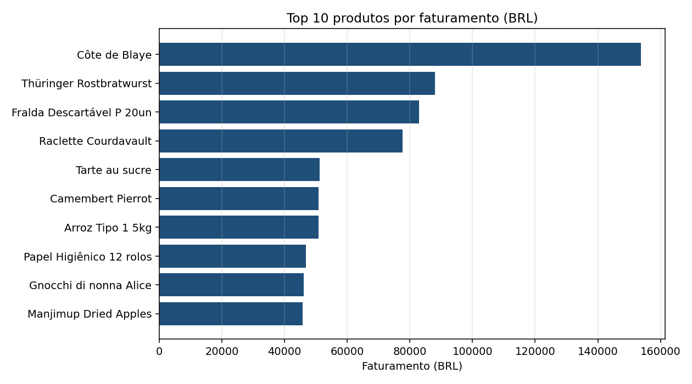
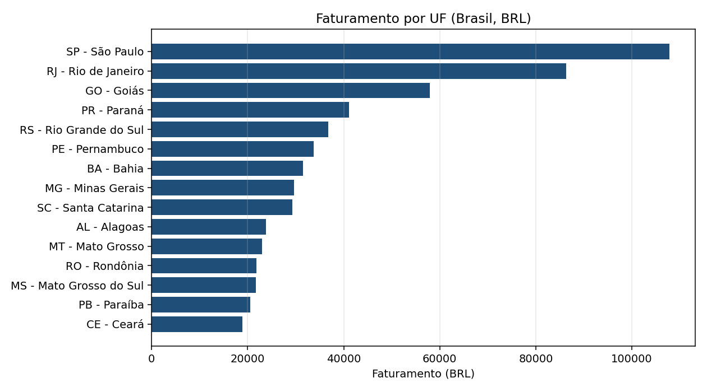
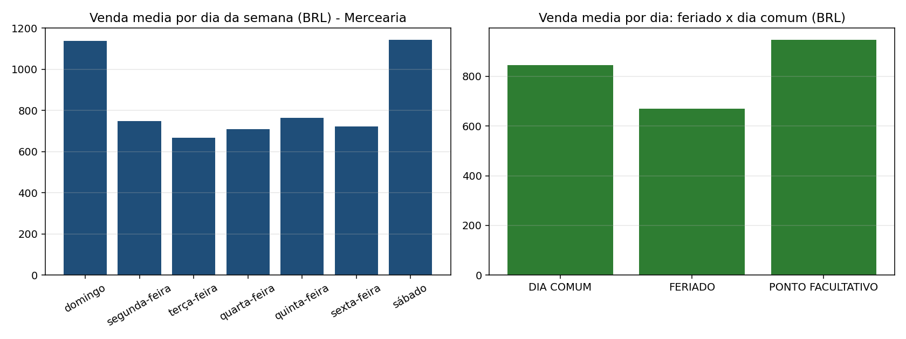
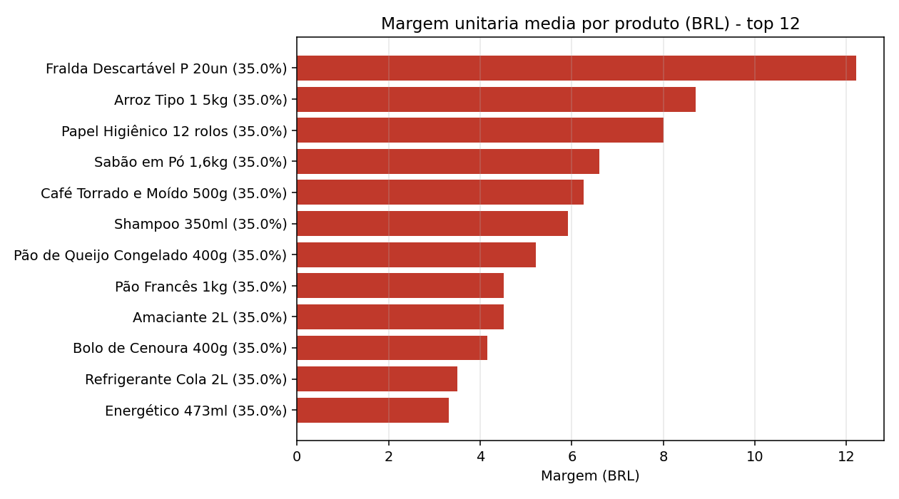

# RELATÓRIO TÉCNICO — Data Warehouse Organizacional e DataMarts

| Campo | Valor |
|---|---|
| **Instituição** | Instituto Federal de Goiás (IFG) — Campus Goiânia |
| **Disciplina** | Tópicos Avançados em Inteligência Artificial I |
| **Professor** | Sirlon Diniz |
| **Autor** | Daniel Flávio |
| **Data de entrega** | 30/09/2026 |

---

## 1. Objetivo

Construir um **Data Warehouse (DW) Organizacional** integrando duas bases de dados distintas —
**Northwind** e **Mercearia** — e, a partir dele, derivar **três DataMarts** de assuntos de negócio
distintos, aplicando ferramentas de análise de dados sobre o DW e sobre os DataMarts.

O trabalho observa os conceitos exigidos: **granularidade**, **integração**, **historicidade**,
**dimensão tempo** e **dados externos**, além da **LGPD** nos atributos sensíveis.

---

## 2. Descrição das fontes

| Fonte | Natureza | Conteúdo verificado |
|---|---|---|
| **Northwind** (`sql/northwind.sql`) | Dump PostgreSQL **com dados** | 14 tabelas · 830 pedidos · 2.155 itens · 91 clientes · 77 produtos · 29 fornecedores · 9 funcionários · 6 transportadoras · pedidos para **21 países** |
| **Mercearia** (`sql/SQL criação DB Mercearia.sql`) | **Somente DDL** (sem nenhum `INSERT`) | 14 tabelas · 0 registros · endereços brasileiros em 5 níveis (UF → Cidade → Bairro → Logradouro → Endereço) |

### 2.1 Declaração de integridade sobre a Mercearia (importante)

O material de origem da Mercearia **não acompanha dados** — é apenas a definição das tabelas.
Para que a integração das duas fontes fosse **demonstrável** (e não apenas desenhada), foi criada uma
massa de dados **sintética, declarada e reprodutível** em `sql/seed_mercearia.sql`:

- nomes de pessoas e empresas **fictícios**;
- CPF/CNPJ **inválidos por construção** (dígitos verificadores não calculados), existindo apenas para
  exercitar o mascaramento exigido pela LGPD;
- UFs com **códigos reais do IBGE** (dado público);
- 3.171 vendas e 150 compras ao longo de 24 meses (10/2024 a 09/2026), com sazonalidade simulada.

**Nenhum dado real de pessoa foi utilizado.** O arquivo original da Mercearia permanece intacto no
repositório. Esta decisão está registrada no cabeçalho do próprio script.

---

## 3. Arquitetura da solução

```
                 ┌──────────────────────── PostgreSQL 16 (Docker) ────────────────────────┐
                 │                                                                        │
  Northwind ───► │  schema public        staging: as duas fontes convivem no mesmo schema │
  Mercearia ───► │  (staging)            (não há colisão de nomes entre elas)             │
                 │                                                                        │
  IBGE      ───► │  schema ext           DADOS EXTERNOS: código do município, população,   │
  BCB/PTAX  ───► │  (externos)           câmbio USD→BRL, feriados, de-para de país        │
                 │                                                                        │
                 │  schema dw            DW ORGANIZACIONAL: 7 dimensões + 3 fatos          │
                 │        │                                                               │
                 │        ├──► schema dm_vendas       DataMart 1 (item de pedido)         │
                 │        ├──► schema dm_suprimentos  DataMart 2 (item de compra)         │
                 │        └──► schema dm_logistica    DataMart 3 (pedido/entrega)         │
                 └────────────────────────────────────────────────────────────────────────┘
```

**Stack:** PostgreSQL 16 (container `postgres:16-alpine`) · ETL em **SQL puro** · carga com um único
comando · análise em **Python 3.13** (pandas, matplotlib, scikit-learn, psycopg2).

> **Sobre a ETL:** o enunciado *permite* ferramentas de integração; optou-se por **SQL puro** por
> transparência e reprodutibilidade — todo o processo é auditável linha a linha nos scripts `etl/*.sql`,
> sem dependência de licença ou de instalação de ferramenta adicional.

A **carga completa em um comando** garante a reprodutibilidade exigida em trabalho de engenharia de dados:

```bash
docker compose up -d
docker compose exec -T db sh /etl/00_carga_inicial.sh
```

Os diagramas (modelo galáxia do DW e os três DataMarts) estão em [`diagramas.md`](diagramas.md).

---

## 4. Decisões de modelagem

Abordagem adotada: **Kimball** — esquema estrela com **barramento de dimensões conformadas**.

### 4.1 Granularidade (o que cada linha representa)

| Fato | Grão | Justificativa |
|---|---|---|
| `fato_vendas` | **1 linha por item** de pedido/venda | menor nível de detalhe disponível; permite qualquer agregação posterior |
| `fato_compras` | **1 linha por item** de compra | idem, para o processo de suprimentos |
| `fato_entregas` | **1 linha por pedido**/entrega | ver abaixo — o frete é do pedido, não do item |

**Por que o terceiro fato tem outro grão?** No Northwind, `orders.freight` é medido **no pedido**. Se o
frete fosse colocado em `fato_vendas` (grão de item), o mesmo valor apareceria **repetido em cada item**
do pedido — dupla contagem —, ou teria de ser **rateado**, gerando um número que não existe na origem.
A solução dimensional correta é **um fato por grão**, com **dimensões conformadas** compartilhadas.
Ou seja: a granularidade não é um detalhe técnico, é uma decisão que **muda o número**.

### 4.2 Integração das duas fontes

| Mecanismo | Como foi aplicado |
|---|---|
| **Chaves naturais por origem** | `origem` (`MERCEARIA` / `NORTHWIND`) + chave natural da fonte, com índice único por origem + versão |
| **Dimensões conformadas** | produto, cliente, fornecedor, localidade e tempo servem aos três fatos |
| **Padronização de rótulo de país** | `Brazil` (Northwind) e `Brasil` (Mercearia) viram **o mesmo país** via tabela de-para `ext.pais_nome` |
| **Normalização de acento/caixa** | `Sao Paulo` (Northwind) e `São Paulo` (Mercearia) reconhecidos como a **mesma cidade** com `unaccent()` |
| **Chave oficial externa** | `codigo_ibge` no município (IBGE) como chave estável de integração com sistemas oficiais |
| **Homogeneidade de medida** | tudo em **BRL** (ver 4.4) |

### 4.3 Historicidade — SCD Tipo 2

Aplicado em **`dim_produto`** (atributo versionado: preço) e **`dim_cliente`** (faixa de renda).
A dimensão guarda `versao`, `data_inicio`, `data_fim` e `flag_atual`, com duas garantias no banco:
índice único por `(origem, chave natural, versão)` e **uma única versão vigente** por chave
(índice parcial `WHERE flag_atual`).

Declarar "SCD2" no DDL **não prova nada** — por isso o comportamento é **demonstrado** por
`etl/90_teste_scd2.sql`, que:

1. simula mudança na fonte (preço de 3 produtos, renda de 2 clientes);
2. roda a atualização incremental;
3. verifica o fechamento da versão antiga e a abertura da nova;
4. **verifica que as vendas antigas permanecem ligadas à versão antiga** — o ponto central da historicidade.

**Evidência de execução:**

| Produto | Versão | Preço | Vigente | Data início | Data fim | Vendas ligadas | Total vendido |
|---|---|---|---|---|---|---|---|
| 1 — Arroz Tipo 1 5kg | 1 | 24,90 | não | 1900-01-01 | 2026-09-28 | **324 linhas** | **R$ 50.845,80** |
| 1 — Arroz Tipo 1 5kg | 2 | 27,39 | **sim** | 2026-09-29 | — | — | — |

O passado **não foi reescrito**. Sem SCD2, as 324 vendas passariam a mostrar o preço novo e a receita
histórica seria distorcida.

### 4.4 Dados externos e conversão de moeda

| Dado externo | Fonte | Onde entra | Por quê |
|---|---|---|---|
| Código do município (7 dígitos) | **IBGE** — Localidades | `dim_localidade.codigo_ibge` | chave estável de integração com sistemas oficiais |
| População residente estimada | **IBGE** — Agregados (6579/9324) | `dim_localidade.populacao` | permite venda per capita |
| Cotação USD→BRL | **BCB** — PTAX/OLINDA | `fato_vendas.taxa_cambio` | o Northwind está em **USD** e a Mercearia em **BRL** |
| Feriados e pontos facultativos | **calculados** (Páscoa por Meeus/Jones/Butcher) | `dim_tempo` | sazonalidade depende de calendário |

Extração documentada e reprodutível em `etl/05_extrair_dados_externos.ps1`:
**39 municípios** e **750 cotações** PTAX (02/01/1996 a 31/12/1998), com data de acesso registrada em
`dados_externos/README.md`.

**Regra do câmbio (decisão registrada):**

1. converte-se USD → BRL pela **cotação de compra** do dia da venda;
2. sem boletim no dia (fim de semana/feriado), usa-se a **última cotação disponível** (*carry forward*),
   materializada em `ext.cotacao_dolar_dia` (1.095 dias);
3. a taxa efetivamente aplicada é **gravada na linha do fato** (`taxa_cambio`), junto com `moeda_origem`.

Taxas efetivamente aplicadas: de **1,0040** a **1,1445** BRL por USD.
Motivo de fundo: somar USD com BRL produz um número sem significado — violação do princípio de
**homogeneidade das medidas**.

### 4.5 Dimensão tempo

`dim_tempo` no grão de **dia**, cobrindo **01/01/1996 a 31/12/2026** = **11.323 dias**.

O período é a **união** dos períodos dos fatos (Northwind 1996–1998 + Mercearia 2024–2026). Gerar apenas
o período recente deixaria as 2.155 linhas de venda do Northwind **órfãs** (sem linha na dimensão).

Conteúdo: ano, semestre, trimestre, mês, nome do mês, dia, dia da semana, indicador de fim de semana,
**281 feriados legais** e **62 pontos facultativos**. `dim_tempo` é usada em **papel duplo** em todos os
fatos (ex.: data da venda e data do faturamento).

> **Rigor conceitual:** **Carnaval** e **Corpus Christi** foram marcados como *ponto facultativo*, e
> **não** como feriado — não são feriados legais. Já o **20/11 (Consciência Negra)** só é marcado como
> feriado **a partir de 2024**, respeitando a Lei 14.759/2023. Essa distinção produziu um achado de
> negócio (item 7.4).

### 4.6 Modelo final do DW

| Tipo | Objetos |
|---|---|
| Dimensões | `dim_tempo`, `dim_localidade`, `dim_produto`, `dim_cliente`, `dim_vendedor`, `dim_fornecedor`, `dim_transportadora` |
| Fatos | `fato_vendas` (item), `fato_compras` (item), `fato_entregas` (pedido) |

Ponto de atenção modelado e documentado: `dim_localidade` tem **profundidade variável** — no Brasil chega
ao **bairro** (121 membros, com CEP representativo e código IBGE) e no exterior fica no nível **cidade/região**
(66 membros, 21 países). O Northwind envia para 21 países, e não apenas para os EUA — fato apurado nos
dados, não presumido. Agregações por cidade/país funcionam porque `nm_cidade` e `pais` são consistentes
entre os dois níveis.

---

## 5. DataMarts

Cada DataMart é um **esquema estrela próprio**, materializado como **tabelas físicas** no PostgreSQL
e carregado **a partir do DW** (o entregável pede a DDL dos DataMarts). As dimensões mantêm a
**mesma chave surrogate** do DW, garantindo a conformidade — verificado por teste automatizado.

| # | DataMart | Assunto | Fato (grão) | Dimensões | Linhas |
|---|---|---|---|---|---|
| 1 | `dm_vendas` | desempenho comercial | `fato_vendas` (item) | tempo (papel duplo), produto, cliente, localidade, vendedor | 11.651 |
| 2 | `dm_suprimentos` | abastecimento e custo | `fato_compras` (item) | tempo (papel duplo), produto, fornecedor | 302 |
| 3 | `dm_logistica` | distribuição e frete | `fato_entregas` (pedido) | tempo (papel duplo), cliente, localidade, transportadora | 830 |

### 5.1 Justificativa de uso de cada DataMart

**1 — Vendas.** Maior alcance: apoia decisões de **preço, mix de produtos, desconto, campanha e alocação
de vendedor**. Responde: o que vende, para quem, onde, por quem e quando; qual o custo do desconto; como
a venda reage a fim de semana e feriado.

**2 — Suprimentos.** Apoia a decisão de **compra**: de quem comprar, a que custo, com que prazo. O
Northwind não possui compras, então este DataMart é da operação da Mercearia — **mas compartilha a mesma
`dim_produto`** do DataMart de Vendas, o que permite o cruzamento mais valioso do trabalho:
**custo de aquisição × preço de venda → margem por produto**.

**3 — Logística.** Existe por razão técnica demonstrada (item 4.1): o frete é do **pedido**. Apoia a
operação na escolha e cobrança de transportadora: prazo médio, frete médio, destinos problemáticos e
efeito de feriado no prazo.

### 5.2 Recorte aplicado nos DataMarts

- **Em linhas:** cada DataMart carrega apenas os membros de dimensão **usados pelos seus fatos** (recorte
  que também reduz volume: `dm_logistica` usa 4 dimensões, não 7).
- **Em colunas (LGPD):** em `dm_logistica.dim_cliente` foram **omitidos** CPF mascarado, faixa de renda e
  data de nascimento — o assunto é entrega, não perfil de consumo (princípio de **minimização**).
- **SCD2 preservado:** entram **todas as versões** referenciadas pelos fatos. Carregar apenas a versão
  vigente deixaria as vendas antigas **órfãs dentro do DataMart**.

---

## 6. Processo de ETL

### 6.1 Etapas (todas em `etl/`, executadas em sequência por `00_carga_inicial.sh`)

| Etapa | Script | O que faz |
|---|---|---|
| 1 | `sql/northwind.sql` + `SQL criação DB Mercearia.sql` | **Extract**: carrega as duas fontes no schema `public` |
| 2 | `sql/seed_mercearia.sql` | seed sintético declarado da Mercearia (idempotente) |
| 3 | `sql/01_dw_organizacional.sql` | **DDL do DW** (idempotente: recria o schema `dw`) |
| 4 | `sql/03_dados_externos.sql` | **dados externos**: IBGE + PTAX + calendário de câmbio + de-para de país |
| 5 | `sql/02_dim_tempo.sql` | carga da dimensão tempo + feriados (Páscoa calculada) |
| 6 | `etl/10_carga_dimensoes.sql` | **Transform + Load** das 7 dimensões (inclui mascaramento LGPD) |
| 7 | `etl/20_carga_fatos.sql` | carga dos 3 fatos (conversão de moeda e papel duplo de tempo) |
| 8 | `etl/99_validacao.sql` | testes de integridade do DW |
| 9 | `sql/04_datamarts.sql` | **DDL dos 3 DataMarts** |
| 10 | `etl/30_carga_datamarts.sql` | carga dos DataMarts a partir do DW (com recorte) |
| 11 | `etl/40_validacao_datamarts.sql` | testes de integridade e de **conformidade** entre DataMarts |

### 6.2 Principais transformações

- **Padronização de moeda:** USD → BRL pela PTAX do dia, com a taxa gravada no fato (auditoria).
- **Padronização de rótulo:** país (de-para) e cidade (`unaccent`, case-insensitive).
- **Generalização (LGPD):** CPF/CNPJ → `'***.***.***-XX'`; renda exata → **faixa** de renda; telefones
  **não** carregados.
- **Tratamento de nulos:** 21 pedidos sem expedição (prazo/data nulos), 507 sem região, campos de
  faturamento/entrada opcionais — todos preservados como `NULL`, sem valor inventado.
- **Derivação:** valor bruto, valor de desconto, valor líquido e prazo de entrega.
  Regra de arredondamento que garante a identidade da linha:
  `vlr_bruto = round(quantidade × vlr_unitario, 2)` · `vlr_desconto = round(vlr_bruto × pct_desconto, 2)`
  · `vlr_liquido = vlr_bruto − vlr_desconto`.

### 6.3 Testes de integridade — resultados

**DW** (`etl/99_validacao.sql`):

| Teste | Resultado |
|---|---|
| Contagens origem × DW (13 comparações) | **todas iguais** (ex.: `fato_vendas` 9.496 Mercearia + 2.155 Northwind) |
| Identidade contábil (`vlr_bruto`, `vlr_liquido`) em 11.651 linhas | **0 erros** |
| Valores negativos | **0** |
| Vendas sem localidade | **0** |
| Registros órfãos (5 FKs testadas) | **0** |
| SCD2: uma única versão vigente por chave (107 chaves) | **100%** |
| Cobertura dos dados externos na dimensão | 120 membros com código IBGE e população |

**DataMarts** (`etl/40_validacao_datamarts.sql`):

| Teste | Resultado |
|---|---|
| Fatos do DataMart × DW (3 comparações) | **iguais** |
| Órfãos nos DataMarts | **0** |
| **Conformidade entre DataMarts** (mesmo membro → mesmos atributos) | **0 divergências** (produto, localidade, cliente, tempo) |
| Membros carregados e não usados | **0** (o recorte funcionou) |
| **LGPD**: colunas sensíveis em `dm_logistica.dim_cliente` | **0** (teste via catálogo `information_schema`) |
| Amostra analítica sobre o DataMart | top 5 produtos retornado corretamente |

### 6.4 Defeitos encontrados durante a execução (e corrigidos)

Registro honesto do processo — todos foram detectados **por teste**, não por inspeção visual:

| # | Defeito | Como foi detectado | Correção |
|---|---|---|---|
| 1 | `Telefones`: ordem de colunas invertida no `INSERT` (ID duplicado) | erro de chave primária na carga | reordenação da lista de colunas |
| 2 | 203 linhas do Northwind **sem localidade** | teste de integridade do DW | o filtro de país excluía os destinos brasileiros; a junção passou a usar o país padronizado e o nível de cidade |
| 3 | Cidade `Sao Paulo` ≠ `São Paulo` (duas cidades na mesma dimensão) | **análise de dados** | normalização com `unaccent()` |
| 4 | UF `SP` duplicada (uma sem nome de estado) | **análise de dados** | preenchimento de `nm_estado` a partir da tabela `Uf` |
| 5 | `curl` no Windows interpretando `[` `]` como curinga | falha de rede na extração | uso de `-g` e codificação `%5B/%5D` |

**Lição de qualidade de dados:** os defeitos 3 e 4 **passaram por todos os testes de contagem** e só
apareceram **no uso analítico**. Teste de contagem não substitui **teste de uso**.

---

## 7. Análise de dados

**Ferramenta:** Python 3.13 (pandas, matplotlib, scikit-learn, psycopg2), conectado diretamente ao banco,
aplicado **ao DW e aos DataMarts**. Script: `analise/analise_dw_datamarts.py`.
Detalhamento completo em [`analises.md`](analises.md); saídas em `analise/figuras/` (8 gráficos) e
`analise/resultados/` (11 tabelas).

### 7.1 Panorama

| Indicador | Valor |
|---|---|
| Linhas de venda (DW e DataMart) | 11.651 |
| Faturamento total (BRL) | **1.991.124,46** |
| Prazo médio de entrega | 8,5 dias |
| Frete médio por pedido | R$ 85,20 |

**Visão temporal (DW).** O gráfico abaixo mostra as duas fontes no tempo — Northwind 1996–1998 e
Mercearia 2024–2026 — e evidencia que **dezembro é pico nas duas bases**.


*Figura 1 — Evolução mensal do faturamento (BRL) por origem.*



*Figura 2 — Top 10 produtos por faturamento (BRL).*



*Figura 3 — Faturamento por UF (Brasil).*

### 7.2 Sazonalidade (DW, usando `dim_tempo`)
Fim de semana vende **~1,5× mais** que dia útil (sábado R$ 1.143,19/dia × segunda R$ 749,24/dia).
**Feriado legal vende 21% MENOS** que um dia comum (R$ 670,76 contra R$ 846,29), enquanto **ponto
facultativo vende mais** (R$ 947,02). O comportamento diferente é o que **justifica** a existência da flag
separada `eh_ponto_facultativo` na dimensão tempo.



*Figura 4 — Venda média por dia da semana e por tipo de dia (feriado × dia comum).*

### 7.3 Logística e conformidade (DataMart 3)
| Transportadora | Pedidos | Prazo médio | Frete médio |
|---|---|---|---|
| Federal Shipping | 255 | **7,5 dias** | R$ 87,00 |
| Speedy Express | 249 | 8,6 dias | **R$ 70,79** |
| United Package | 326 | 9,2 dias | R$ 94,80 |

**United Package** concentra o maior volume, tem o **pior prazo** e o **maior frete** — prioridade de
renegociação. Não há trade-off "rápido × barato" nos dados.


*Figura 5 — Prazo médio de entrega por transportadora (dias).*

### 7.4 Análise cruzada de DataMarts (margem)
O cruzamento `dm_suprimentos` (custo) × `dm_vendas` (preço) só é possível porque as dimensões são
**conformadas**. **Limitação declarada:** a margem apurada ficou uniformemente em 35% por um **artefato do
seed sintético** (custo gerado como 65% do preço) — o **método** está correto, o **número** não é
interpretável. Com dados reais, a margem variaria por produto.



*Figura 6 — Margem unitária média por produto (BRL) — cruzamento entre os DataMarts de Suprimentos e Vendas.*

### 7.5 IA aplicada
1. **Segmentação de clientes (K-Means sobre RFM)** — 60 clientes em 3 grupos. Destaque: o segmento
   intermediário (13 clientes) tem valor próximo ao topo, mas **46 dias de recência** — alvo natural de
   campanha de reativação. *Limitação:* no seed sintético todos compram com frequência parecida, então o
   agrupamento separou sobretudo por **valor**.
2. **Projeção de vendas (regressão linear)** — R² = **0,866**, tendência praticamente estável
   (−R$ 31,76/mês) e **efeito de dezembro de +R$ 21.686,08**; projeção de dezembro: R$ 44.994,89.
   O R² alto decorre do **efeito sazonal**, não de crescimento.


*Figura 7 — Segmentação de clientes por K-Means (k=3) sobre recência × valor.*


*Figura 8 — Faturamento mensal e projeção por regressão linear (R² = 0,866).*

### 7.6 Achados de negócio
1. Fim de semana vende ~1,5× mais; **feriado legal vende 21% menos**.
2. **Dezembro** é pico nas **duas** bases — sazonalidade consistente entre fontes de épocas diferentes.
3. A Mercearia fatura por **volume**; o Northwind, por **valor unitário**.
4. **United Package**: maior volume, pior prazo, maior frete.
5. **13 clientes** com 46 dias de recência: melhor oportunidade de reativação.
6. **SP** lidera o faturamento, mas **GO** é o 2º em número de pedidos (efeito da base local).

---

## 8. LGPD

Aplicada de forma **preventiva** — ainda assim relevante, porque o DW modelado lidaria com dados pessoais
se alimentado por uma base real (Lei 13.709/2018). Medidas implementadas:

| Medida | Onde |
|---|---|
| **Minimização** — apenas os atributos necessários entram no DW | telefones (`Telefones`) **não** são carregados; nenhum uso analítico existe para eles |
| **Mascaramento** — CPF/CNPJ reduzido a `'***.***.***-XX'` | `dim_cliente.cpf_cnpj_masked` |
| **Generalização** — renda exata → **faixa** de renda | `dim_cliente.faixa_renda` |
| **Minimização por assunto** — CPF, renda e data de nascimento **omitidos** | `dm_logistica.dim_cliente` (teste D5 verifica via catálogo) |
| **Dados sintéticos declarados** — nenhum dado real de pessoa | `sql/seed_mercearia.sql` |
| **Dado público** — o *sample* Northwind é fictício | `sql/northwind.sql` |

---

## 9. Limitações e trabalhos futuros

1. **Massa sintética na Mercearia** — necessária porque a fonte não acompanha dados. Consequência:
   margem uniforme e clientes homogêneos em frequência (itens 7.4 e 7.5). Com dados reais, os achados
   seriam mais ricos.
2. **Salto temporal entre as fontes** — Northwind 1996–1998 e Mercearia 2024–2026: os dados são
   integrados por dimensões conformadas, mas **não** devem ser lidos como uma série contínua de uma mesma
   economia (a conversão cambial garante homogeneidade de moeda, não comparabilidade de mercado).
3. **Dimensão localidade com profundidade variável** (bairro no Brasil, cidade no exterior) — alternativa
   futura: desmembrar em `dim_cidade` + `dim_bairro` (floco de neve).
4. **Projeção linear** é didática (24 pontos, 2 variáveis); a evolução natural seria SARIMA/Prophet usando
   os atributos de `dim_tempo` (feriados, dia da semana).
5. **Carga completa** (full load) em vez de incremental — adequado ao volume acadêmico; em produção,
   haveria carga incremental com controle de watermark.

---

## 10. Conclusão

O trabalho entregou um DW Organizacional que **integra de fato** duas fontes de estruturas e semânticas
diferentes: 4 dimensões recebem registros das duas bases, os rótulos conflitantes foram padronizados
(país e acento de cidade) e as medidas foram tornadas homogêneas pela conversão cambial auditável.

Os três requisitos foram atendidos: (1) DW integrando Northwind e Mercearia; (2) **três DataMarts**
modelados com assunto, fato, grão, dimensões e justificativa, materializados com DDL própria e validados
por testes de conformidade; (3) **análise de dados aplicada ao DW e aos DataMarts**, incluindo dois
modelos de aprendizado de máquina.

Os conceitos exigidos não ficaram no texto: **granularidade** gerou um fato adicional (frete),
**integração** exigiu tabela de-para e normalização de texto, **historicidade** foi demonstrada com
vendas antigas preservadas na versão antiga do preço, a **dimensão tempo** cobre a união dos períodos,
os **dados externos** enriquecem localidade e câmbio, e a **LGPD** orientou quatro decisões de
minimização e ofuscação. Por fim, a execução real revelou cinco defeitos que os testes capturaram —
evidência de que o processo foi **verificado**, e não apenas escrito.

---

## 11. Referências

- KIMBALL, R.; ROSS, M. *The Data Warehouse Toolkit: The Definitive Guide to Dimensional Modeling*. 3. ed. Wiley, 2013.
- INSTITUTO BRASILEIRO DE GEOGRAFIA E ESTATÍSTICA (IBGE). *API de Localidades* e *Agregados (6579/9324 — população residente estimada)*. Acesso em: 29 set. 2026.
- BANCO CENTRAL DO BRASIL. *PTAX — Cotações e boletins* (OLINDA). Acesso em: 29 set. 2026.
- BRASIL. *Lei nº 13.709, de 14 de agosto de 2018* (Lei Geral de Proteção de Dados Pessoais).
- BRASIL. *Lei nº 14.759, de 21 de dezembro de 2023* (feriado nacional de 20 de novembro).
- NORTHWIND. *Sample database* (distribuído publicamente para fins didáticos).

---

## Anexos

| Anexo | Arquivo |
|---|---|
| DDL do DW | `sql/01_dw_organizacional.sql` |
| DDL da dimensão tempo e carga | `sql/02_dim_tempo.sql` |
| DDL dos dados externos | `sql/03_dados_externos.sql` |
| **DDL dos DataMarts** | `sql/04_datamarts.sql` |
| Carga completa (um comando) | `etl/00_carga_inicial.sh` |
| Extração de dados externos | `etl/05_extrair_dados_externos.ps1` |
| ETL das dimensões e dos fatos | `etl/10_carga_dimensoes.sql`, `etl/20_carga_fatos.sql` |
| Teste de historicidade (SCD2) | `etl/90_teste_scd2.sql` |
| Testes de integridade | `etl/99_validacao.sql`, `etl/40_validacao_datamarts.sql` |
| Diagramas (DW e DataMarts) | `docs/diagramas.md` |
| Modelagem e justificativa dos DataMarts | `docs/datamarts.md` |
| Análise de dados | `docs/analises.md` + `analise/analise_dw_datamarts.py` |
| Dados externos (CSV + fontes) | `dados_externos/` |
