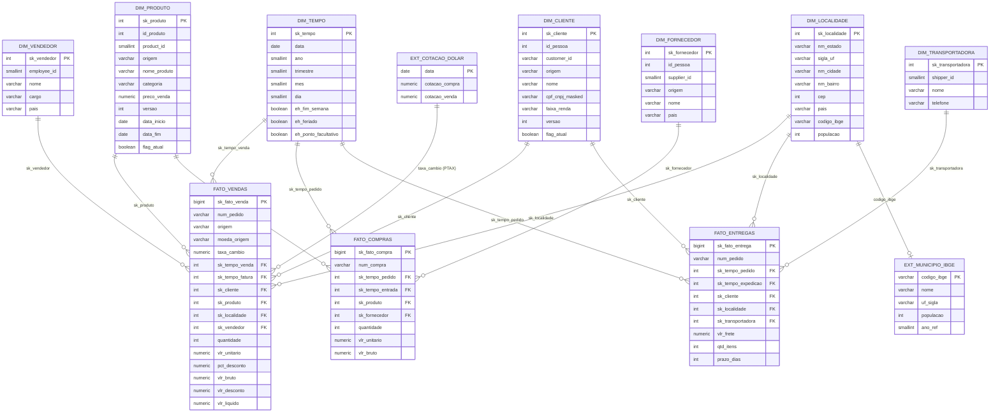
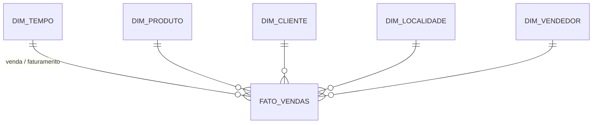
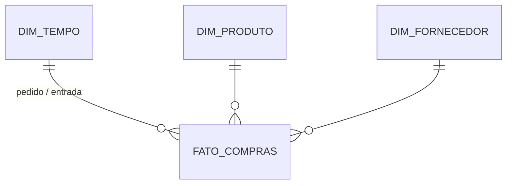
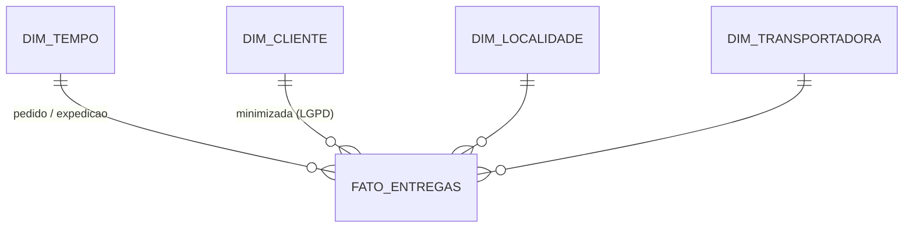
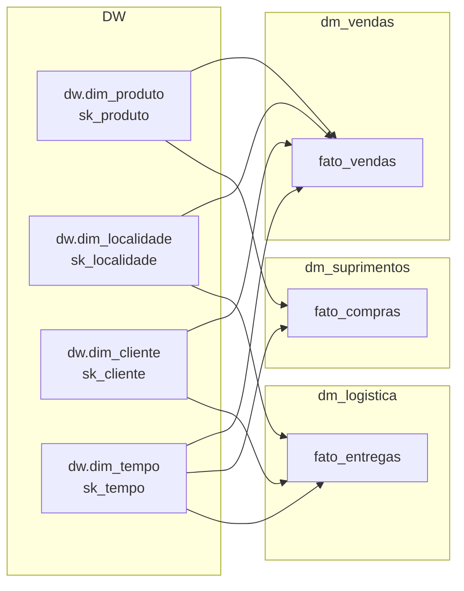

# 🗺️ Diagramas do DW e dos DataMarts

> Diagramas em **Mermaid** (renderizam direto no GitHub e no VS Code).
> Os diagramas podem ser copiados para o relatório ou colados no <https://mermaid.live>.
> O dicionário completo de atributos está na DDL: `sql/01_dw_organizacional.sql` e `sql/04_datamarts.sql`.

---

## 1. DW Organizacional (modelo galáxia / constelação de fatos)

Três fatos em **grãos diferentes**, compartilhando **dimensões conformadas**.

> **Papel duplo:** `dim_tempo` aparece **duas vezes em cada fato** (ex.: `sk_tempo_venda` e
> `sk_tempo_fatura`). O diagrama mostra apenas o primeiro papel para não duplicar setas — os dois
> relacionamentos existem no DDL.

---

## 2. DataMart de Vendas (`dm_vendas`)

## 3. DataMart de Suprimentos (`dm_suprimentos`)

## 4. DataMart de Logística (`dm_logistica`)

---

## 5. Conformidade entre os DataMarts

O mesmo membro tem a **mesma chave surrogate** nos três DataMarts, o que permite combinar fatos:

**Exemplo de análise cruzada permitida:** vendas por transportadora, ligando `dm_vendas.fato_vendas`
a `dm_logistica.fato_entregas` pela localidade conformada (`sk_localidade`).
